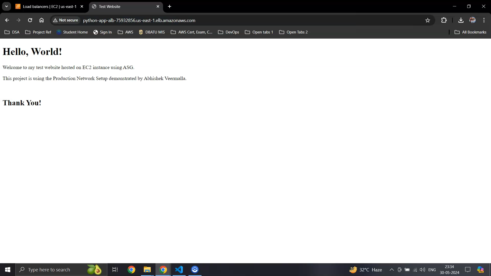

# AWS Production Grade Network Project

In this project, I have created a production grade highly-available AWS network consisting of the following components:

- 1 VPC (Virtual Private Cloud)
- 1 IGW (Internet Gateway)
- 4 Subnets
  - 2 Public
  - 2 Private
- 2 NAT (Network Address Translation) Gateways - 1 in each Public Subnet
- 2 Elastic IPs (EIPs) - Assigned to both NAT Gateways
- 3 Route Tables (RT)
  - Public Subnets' traffic to Internet Gateway
  - Private Subnet 1 traffic to NAT Gateway 1
  - Private Subnet 2 traffic to NAT Gateway 2
- 1 [Bastion EC2 Host](bastion-ec2.tf)
- 3 [Security Groups](security-groups.tf) (SG)
  - Allow SSH traffic from anywhere to the Bastion Host
  - Allow traffic from the Bastion Host (port 22) and Application Load Balancer (ALB) (ports 80, 8000) to instances in the Auto-Scaling Group
  - Allow all traffic on port 80 from the internet to the ALB
- 1 [Launch Template](launch_template.tf) (LT)
- 1 [Auto-Scaling Group](asg.tf) (ASG)
- 1 [Target Group](target-group.tf) (TG)
- 1 [Application Load Balancer](alb.tf) (ALB)

> The [network.tf](network.tf) file contains the code to create the VPC, IGW, Subnets, EIPs, NAT Gateways and Route Tables.

## Infrastructure Diagram

<div align="center">
    
</div>

## Summary of the Infrastructure

- After deploying the network infrastructure in AWS, I created a Bastion Host in one of the public subnets to connect to the instances running the project web server.
- I created a launch template used by the auto-scaling groups to provision or destroy instances (scale in or scale out) based on required resource usage.
- In this launch template, I utilized the **"User Data"** attribute to set up the instances during boot. It is as follows:

```
#!/bin/bash
# Update the package index
apt-get update -y

# Install Python3 if not already installed
apt-get install -y python3

# Create a directory for the website
mkdir -p /var/www/html

# Create the index.html file with the HTML content
cat <<EOT > /home/ubuntu/index.html
<!DOCTYPE html>
<html>
<head>
    <title>Test Website</title>
</head>
<body>
    <h1>Hello, World!</h1>
    <p>Welcome to my test website hosted on EC2 instance using ASG.</p>
    <p>This project is using the Production Network Setup demonstrated by Abhishek Veermalla in his AWS Zero to Hero playlist.</p>
    <br>
    <h2>Thank You!</h2>
</body>
</html>
EOT

cp /home/ubuntu/index.html /var/www/html/

# Change to the directory where index.html is located
cd /var/www/html

# Run the Python HTTP server on port 8000 as a background process
nohup python3 -m http.server 8000 &
```

- Subsequently, I created an auto-scaling group that uses the above launch template specifying the desired capacity (2 instances), minimum capacity (1 instance), and maximum capacity (3 instances).
- I then created a target group that registers the auto-scaling group instances as targets for the application load balancer traffic.
- Then, I Created an application load balancer in the public subnets with a default action listener rule to forward traffic received on port 80 to the attached target group.
- Finally, I created security groups for the bastion host, auto-scaling group instances, application load balancer to secure them and allow only specific traffic.

## Steps to set up the Infrastructure

#### Step 1 : **Install** [terraform](https://developer.hashicorp.com/terraform/install) 

#### Step 2 : **Clone** the repository

```
git clone https://github.com/PrajwalP7295/Production-AWS-Network-Setup-Using-Terraform.git
```

#### Step 3 : Change the **credential** values 

You need to change the values of `Region`, `Profile`, `Access Key` and `Secret Access Key` in [provider.tf](provider.tf) with your own AWS IAM user credentials. 

You can also change the default values for all the variables in the [variables.tf](variables.tf).

#### Step 4 : Deploy the infrastructure

Open **terminal** in the project directory and run the below commands :-

```
terraform init

terraform validate

terraform plan              # To check which resources are being created and their properties

terraform apply             # Create resources
```

#### Step 5 : To **delete** the above created set of resources, run the following command :-

```
terraform destroy           # Delete all the resources created using above commands (Does not delete resources created through AWS console)
```

## Final Output

- Step-by-step method to create and destroy resources : [Watch this video](media/Prod_Network_AWS.mp4).
<!-- <video width="320" height="240" controls>
  <source src="./images/Prod_Network_AWS.mp4" type="video/mp4">
</video> -->

- The output obtained by accessing the ALB DNS on the browser :
<div align="center">
    
</div>

## Reference

ABHISHEK VEERAMALLA - AWS Zero to Hero (Day 7)
[Click here](https://www.youtube.com/watch?v=FZPTL_kNvXc&list=PLdpzxOOAlwvLNOxX0RfndiYSt1Le9azze&index=9)
